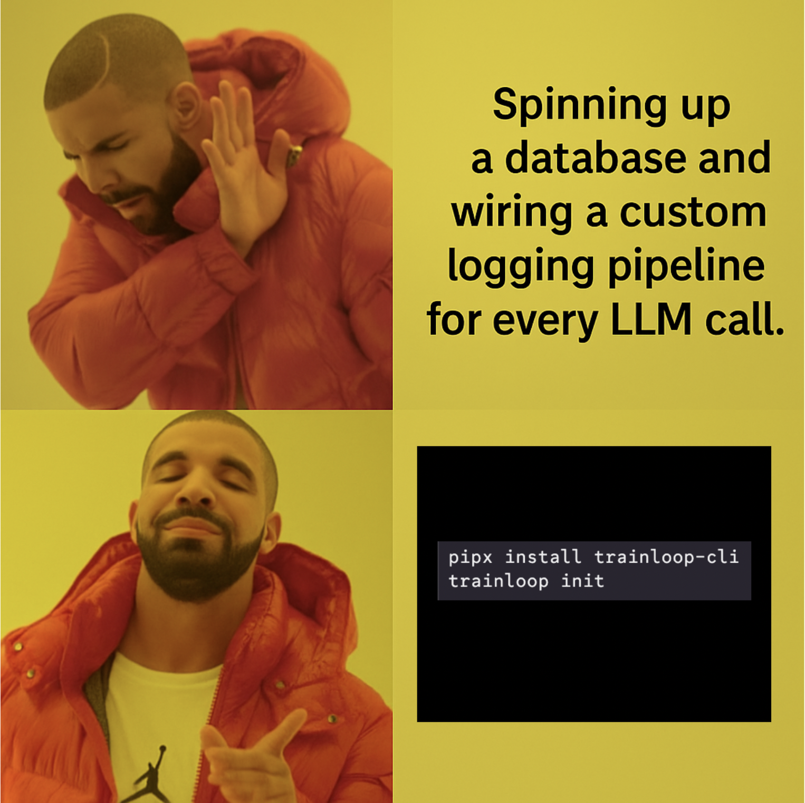

# 🤖📊 TrainLoop Evals (ALPHA)

TrainLoop Evals is a framework for automating the collection and evaluation of LLM outputs. The core tenants of this are

- *Simplicity First* – one environment variable, one function call, one folder of JSON files.
- *Vendor Independence* – everything stored as newline-delimited JSON; no databases required.
- *Meet developers where they are* – accepts our simple declarative flow or existing bespoke loops.
- *Type-safe, In-code Tests* – all code present in codebase
- *Composable, Extensible System* – helper generators mimic shadcn patterns. (`trainloop add` coming soon!)

<p align="center">
  
</p>

## Demo

- Demo repo: https://github.com/TrainLoop/chat-ui-demo
- Demo deployment: https://evals.trainloop.ai


## Getting started

1. We rely on `pipx` to install the CLI. If you don't have it, follow the [instructions](https://pipx.pypa.io/stable/).
2. Install the CLI and create a workspace:
   ```bash
   pipx install trainloop-cli
   trainloop init
   ```
3. Set the data path where your data will be written or use the default (inside the trainloop folder) – this is where the SDKs write events.
4. Instrument your app:
   - **Node**: `NODE_OPTIONS="--require=trainloop-evals-sdk" <your start script>`
   - **Python**: `from trainloop_evals import collect; collect(<your config path>)`

5. Write metrics and suites in `trainloop/eval/`
6. Run the evals and open the UI:
   ```bash
   trainloop eval
   ```
7. Visualize eval results and data in the Studio UI.
   ```bash
   trainloop studio
   ```

## About the TrainLoop Folder

The TrainLoop folder is where all your TrainLoop-specific files live and is created via `trainloop init`. It is structured by default as a data directory, evals directory, and config file.

You can find more information about it in [the Scaffold README](cli/scaffold/trainloop/README.md).

## About this repository
The repository is split into several packages:

- **cli/** – command line tool to scaffold workspaces, run suites and launch the Studio.
- **evals-sdk/typescript/** – Node SDK that logs LLM calls automatically.
- **evals-sdk/python/** – Python SDK for the same purpose.
- **ui/** and **runner/** – TrainLoop Studio web interface and its small runner.
- **infra/** – Pulumi config to deploy the Studio demo.

## More information

- [CLI README](cli/README.md)
- [TypeScript SDK](evals-sdk/typescript/README.md)
- [Python SDK](evals-sdk/python/README.md)
- [Studio UI](ui/README.md)
- [Studio Runner](runner/README.md)
- [Infrastructure](infra/README.md)
- [Contributing](CONTRIBUTING.md)
- [Versioning](VERSIONING.md)
- [Changelog](CHANGELOG.md)

## License

MIT
