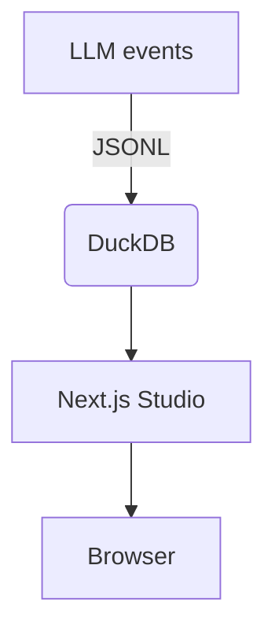

# Launching Studio

Run the UI from your workspace:

```bash
trainloop studio
```

Set `TRAINLOOP_DATA_FOLDER` to point at your data directory. The UI loads events and results from that path.

```bash
export TRAINLOOP_DATA_FOLDER="~/my-project/trainloop/data"
trainloop studio
```

Mermaid diagram of the data flow:



If events or results are missing, the UI shows empty views. Make sure your CLI runs first to collect data.
